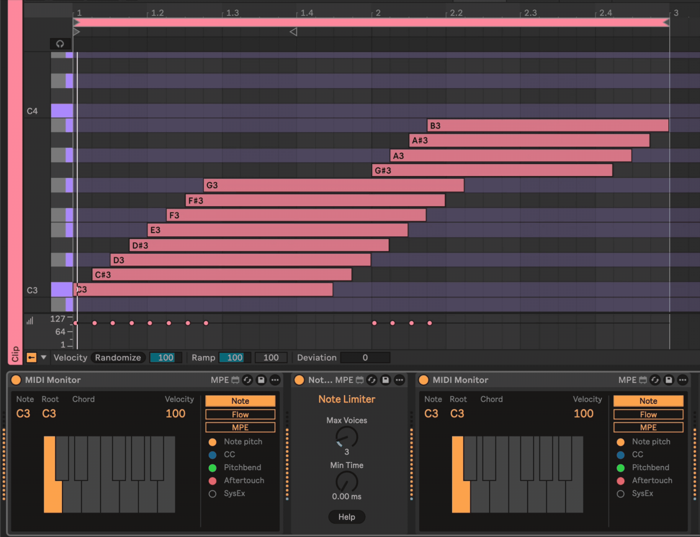

# Note Limiter

Note Limiter has a single purpose -- to limit the number of MIDI notes that it allows to pass. It has control over voices (polyphony) and minimum time between note-on events.

## Installation

[Download the newest release](https://github.com/zsteinkamp/m4l-NoteLimiter/releases) or clone this repository, and drag the `NoteLimiter.amxd` device into a track in Ableton Live.

## Changelog

- 2026-02-02 [v1](https://github.com/zsteinkamp/m4l-NoteLimiter/releases/download/v1/NoteLimiter-v1.amxd) - Initial Release.

## Usage

* Add this device to a MIDI track.
* Use the `Max Voices` dial to control polyphony (first note always wins). When the value of this dial changes, an "all notes off" message is sent to the MIDI output.
* Use the `Min Time` dial to control how much time is required between note-on events.

## TODO

- Add voice steal modes
- Only pass relevant note-offs
- Overflow notes alternate MIDI channel destination

